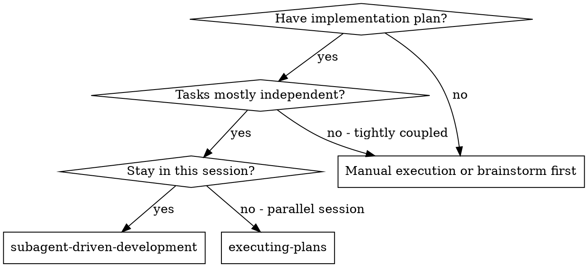
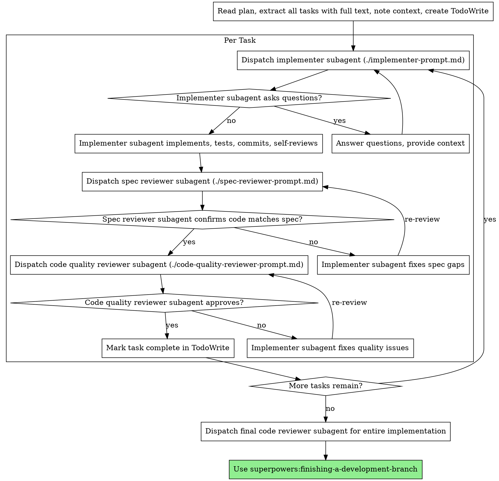

# 하위 에이전트 중심 개발

작업별로 새로운 하위 에이전트를 파견하여 계획을 실행합니다. 각 작업 이후에는 2단계 검토(사양 준수 검토를 먼저 한 다음 코드 품질 검토)를 수행합니다.

**하위 에이전트가 필요한 이유:** 격리된 컨텍스트를 가진 전문 에이전트에게 작업을 위임합니다. 지침과 맥락을 정확하게 작성함으로써 그들이 집중력을 유지하고 업무에 성공하도록 할 수 있습니다. 세션의 컨텍스트나 기록을 상속해서는 안 됩니다. 필요한 것을 정확하게 구성하면 됩니다. 이는 또한 조정 작업을 위한 자체 컨텍스트를 보존합니다.

**핵심 원칙:** 작업당 새로운 하위 에이전트 + 2단계 검토(사양 다음 품질) = 고품질, 빠른 반복

**연속 실행:** 작업 사이에 인간 파트너와 확인하기 위해 일시 ​​중지하지 마십시오. 중단 없이 계획의 모든 작업을 실행합니다. 중지해야 하는 유일한 이유는 해결할 수 없는 BLOCKED 상태, 진정으로 진행을 방해하는 모호성 또는 모든 작업 완료입니다. "계속해야 할까요?" 프롬프트와 진행 상황 요약은 시간을 낭비합니다. 계획을 실행하라고 요청했으므로 실행하세요.

## 관련 에이전트 팀

- 기본 팀 정의는 `../../../.codex/agents/*.toml`와 `../agent-team/SKILL.md`를 따른다.
- 기획은 `product-manager`, 디자인은 `designer`, 실행은 `executer`, 검토는 `reviewer` 역할로 분리한다.
- 이 스킬의 implementer는 기본적으로 `executer` 역할을 수행한다.
- 이 스킬의 spec reviewer와 code quality reviewer는 기본적으로 `reviewer` 역할을 수행한다.

## 사용 시기


**대 계획 실행(병렬 세션):**
- 동일한 세션(컨텍스트 전환 없음)
- 작업당 새로운 하위 에이전트(컨텍스트 오염 없음)
- 각 작업 후 2단계 검토: 먼저 사양 준수, 그 다음 코드 품질
- 더 빠른 반복(작업 간 휴먼 인 루프 없음)

## 프로세스


## 모델 선택

각 역할을 처리할 수 있는 가장 성능이 낮은 모델을 사용하여 비용을 절약하고 속도를 높이세요.

**기계적 구현 작업**(격리된 기능, 명확한 사양, 1-2개의 파일): 빠르고 저렴한 모델을 사용합니다. 계획이 잘 지정되어 있으면 대부분의 구현 작업은 기계적입니다.

**통합 및 판단 작업**(다중 파일 조정, 패턴 일치, 디버깅): 표준 모델을 사용합니다.

**아키텍처, 설계 및 검토 작업**: 가장 유능한 모델을 사용합니다.

**작업 복잡성 신호:**
- 완전한 사양으로 1~2개 파일 터치 → 저렴한 모델
- 통합 우려가 있는 여러 파일 터치 → 표준 모델
- 설계 판단 또는 폭넓은 코드베이스 이해 필요 → 가장 유능한 모델

## 구현자 상태 처리

구현자 하위 에이전트는 네 가지 상태 중 하나를 보고합니다. 각각을 적절하게 처리하십시오.

**완료:** 사양 준수 검토를 진행합니다.

**DONE_WITH_CONCERNS:** 구현자가 작업을 완료했지만 의심스러운 점을 표시했습니다. 계속하기 전에 우려사항을 읽어보세요. 정확성이나 범위에 대한 우려 사항이 있는 경우 검토 전에 문제를 해결하세요. 관찰 내용인 경우(예: "이 파일이 점점 커지고 있습니다.") 이를 기록하고 검토를 진행하세요.

**NEEDS_CONTEXT:** 구현자에게 제공되지 않은 정보가 필요합니다. 누락된 컨텍스트를 제공하고 다시 디스패치하세요.

**차단됨:** 구현자가 작업을 완료할 수 없습니다. 차단제를 평가합니다.
1. 컨텍스트 문제인 경우 더 많은 컨텍스트를 제공하고 동일한 모델로 다시 디스패치합니다.
2. 작업에 더 많은 추론이 필요한 경우 더 유능한 모델로 다시 파견합니다.
3. 작업이 너무 크면 작은 조각으로 나누세요.
4. 계획 자체가 잘못된 경우 담당자에게 에스컬레이션

**절대로** 에스컬레이션을 무시하거나 동일한 모델을 변경 없이 강제로 다시 시도하지 마세요. 구현자가 중단되었다고 말하면 뭔가 변경해야 합니다.

## 프롬프트 템플릿

- `./implementer-prompt.md` - 구현자 하위 에이전트 디스패치
- `./spec-reviewer-prompt.md` - 사양 준수 검토자 하위 에이전트 디스패치
- `./code-quality-reviewer-prompt.md` - 디스패치 코드 품질 검토자 하위 에이전트

## 작업 흐름 예시

```
You: I'm using Subagent-Driven Development to execute this plan.

[Read plan file once: docs/superpowers/plans/feature-plan.md]
[Extract all 5 tasks with full text and context]
[Create TodoWrite with all tasks]

Task 1: Hook installation script

[Get Task 1 text and context (already extracted)]
[Dispatch implementation subagent with full task text + context]

Implementer: "Before I begin - should the hook be installed at user or system level?"

You: "User level (~/.config/superpowers/hooks/)"

Implementer: "Got it. Implementing now..."
[Later] Implementer:
  - Implemented install-hook command
  - Added tests, 5/5 passing
  - Self-review: Found I missed --force flag, added it
  - Committed

[Dispatch spec compliance reviewer]
Spec reviewer: ✅ Spec compliant - all requirements met, nothing extra

[Get git SHAs, dispatch code quality reviewer]
Code reviewer: Strengths: Good test coverage, clean. Issues: None. Approved.

[Mark Task 1 complete]

Task 2: Recovery modes

[Get Task 2 text and context (already extracted)]
[Dispatch implementation subagent with full task text + context]

Implementer: [No questions, proceeds]
Implementer:
  - Added verify/repair modes
  - 8/8 tests passing
  - Self-review: All good
  - Committed

[Dispatch spec compliance reviewer]
Spec reviewer: ❌ Issues:
  - Missing: Progress reporting (spec says "report every 100 items")
  - Extra: Added --json flag (not requested)

[Implementer fixes issues]
Implementer: Removed --json flag, added progress reporting

[Spec reviewer reviews again]
Spec reviewer: ✅ Spec compliant now

[Dispatch code quality reviewer]
Code reviewer: Strengths: Solid. Issues (Important): Magic number (100)

[Implementer fixes]
Implementer: Extracted PROGRESS_INTERVAL constant

[Code reviewer reviews again]
Code reviewer: ✅ Approved

[Mark Task 2 complete]

...

[After all tasks]
[Dispatch final code-reviewer]
Final reviewer: All requirements met, ready to merge

Done!
```
## 장점

**대 수동 실행:**
- 하위 에이전트는 자연스럽게 TDD를 따릅니다.
- 작업별 새로운 컨텍스트(혼란 없음)
- 병렬 안전(하위 에이전트가 간섭하지 않음)
- 하위 상담원이 질문할 수 있습니다(작업 전 및 작업 중).

**대 실행 계획:**
- 동일한 세션(핸드오프 없음)
- 지속적인 진행(기다림 없음)
- 체크포인트 자동 검토

**효율성 향상:**
- 파일 읽기 오버헤드 없음(컨트롤러가 전체 텍스트 제공)
- 컨트롤러는 필요한 컨텍스트를 정확하게 선별합니다.
- 하위 에이전트는 완전한 정보를 미리 얻습니다.
- 작업 시작 전(후가 아님)에 나타나는 질문

**품질 게이트:**
- 핸드오프 전 자체 검토를 통해 문제 파악
- 2단계 검토: 사양 준수, 코드 품질
- 검토 루프를 통해 수정 사항이 실제로 작동하는지 확인
- 사양 준수로 인해 과잉/과소 구축이 방지됩니다.
- 코드 품질은 구현이 잘 구축되었는지 보장합니다.

**비용:**
- 더 많은 하위 에이전트 호출(작업당 구현자 + 2명의 검토자)
- 컨트롤러가 더 많은 준비 작업을 수행합니다(모든 작업을 미리 추출).
- 검토 루프에 반복 추가
- 그러나 문제를 조기에 포착합니다(나중에 디버깅하는 것보다 저렴함).

## 위험 신호

**절대 안 함:**
- 명시적인 사용자 동의 없이 메인/마스터 브랜치에서 구현 시작
- 검토 건너뛰기(사양 준수 또는 코드 품질)
- 수정되지 않은 문제를 진행합니다.
- 여러 구현 하위 에이전트를 병렬로 디스패치(충돌)
- 하위 에이전트가 계획 파일을 읽도록 합니다(대신 전체 텍스트 제공).
- 장면 설정 컨텍스트 건너뛰기(하위 에이전트는 작업이 적합한 위치를 이해해야 함)
- 하위 상담원 질문 무시(진행하기 전에 답변)
- 사양 준수에 대해 "충분히 근접함"을 수락합니다(사양 검토자가 문제를 발견함 = 완료되지 않음).
- 검토 루프 건너뛰기(검토자가 발견한 문제 = 구현자 수정 = 다시 검토)
- 구현자 자체 검토가 실제 검토를 대체하도록 합니다(둘 다 필요함).
- **스펙을 준수하기 전에 코드 품질 검토 시작 ✅** (잘못된 주문)
- 검토 중 미해결 문제가 있는 동안 다음 작업으로 이동합니다.

**하위 상담원이 질문하는 경우:**
- 명확하고 완전하게 답변하세요.
- 필요한 경우 추가 컨텍스트를 제공하세요.
- 서둘러 구현하지 마세요.

**검토자가 문제를 발견한 경우:**
- 구현자(동일한 하위 에이전트)가 이를 수정합니다.
- 리뷰어가 다시 리뷰합니다.
- 승인될 때까지 반복
- 재검토를 건너뛰지 마세요

**하위 에이전트가 작업에 실패하는 경우:**
- 특정 지침이 포함된 수정 하위 에이전트 파견
- 수동으로 수정하려고 하지 마세요(컨텍스트 오염).

## 통합

**필요한 작업 흐름 기술:**
- **초강력:using-git-worktrees** - 격리된 작업 공간 보장(작업 공간을 생성하거나 기존 확인)
- **superpowers:writing-plans** - 이 스킬이 실행하는 계획을 만듭니다.
- **superpowers:requesting-code-review** - 리뷰어 하위 에이전트를 위한 코드 리뷰 템플릿
- **초능력:개발 지점 완료** - 모든 작업 후 개발 완료

**하위 상담원은 다음을 사용해야 합니다.**
- **초능력:테스트 중심 개발** - 하위 에이전트는 각 작업에 대해 TDD를 따릅니다.

**대체 작업 흐름:**
- **superpowers:executing-plans** - 동일 세션 실행 대신 병렬 세션에 사용
